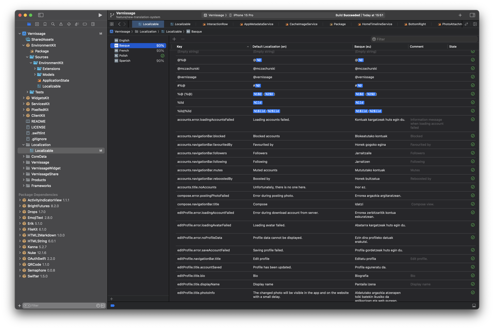

# Vernissage

   

Vernissage is a simple and intuitive Pixelfed client that is focused on showcasing and sharing photos.
With Vernissage, you can browse through a timeline that is dedicated to photos only.
This means that you won't find any other types of media in the app, so you can focus solely on discovering and enjoying beautiful photography.

Our app features a clean and minimalistic interface that is designed to put the focus on the images.
You can easily like and comment on photos, as well as follow other users to keep up with their latest posts.

Vernissage is 100% free and open-source.

So, whether you're a professional photographer, an amateur enthusiast, or simply someone who loves to discover and share stunning photos,
Vernissage is the perfect app for you. Try it out today and join our growing community of passionate photo lovers.

It's built entirely in SwiftUI.

## Contributing

You can fork and clone repository. Change development team and bundle id. Do your changes and create a pull a request 👍.

Thank you in advance for any, even the smallest help, with the development of the project 💕!

## Translations

Application is using new translation mechanism introduced in XCode 15 (xcstring). Here you can find description how this mechanism is working: [https://www.youtube.com/watch?v=jNbnwwLrJE8](https://www.youtube.com/watch?v=jNbnwwLrJE8).

In the applications we have several string catalogs:
 - Localization/Localizable
 - EnvironmentKit/Source/EnvironmentKit/Localizable
 - WidgetKit/Source/WidgetKit/Localizable
 - ServicesKit/Source/ServicesKit/Localizable
 - PixelfedKit/Source/PixelfedKit/Localizable
 - ClientKit/Source/ClientKit/Localizable

Right now it's very easy to find new (not translated yet) titles. Also you can mark titles which need some review.
However you need to have XCode 15 installed. There isn't right now good external tool that have similar features.

 

From time to time you have to come back and translate lines which has been added since the last translation. 

## Technical debt

Things that should be implemented in version 2.0:

 - [ ] Use auto generated resources (Color/Images) instead static extensions (how to do this in separete Swift Packages?)
 - [x] Move to xcstring (new Xcode transaction system)
 - [x] Move to new Observable macro (iOS 17)
 - [x] Migrate to SwiftData (iOS 17)
 - [ ] Use ViewModels
 - [x] Add tips (new TipKit framework in iOS 17)
 - [ ] Enable swiftlint (https://github.com/realm/SwiftLint/issues/5053)
